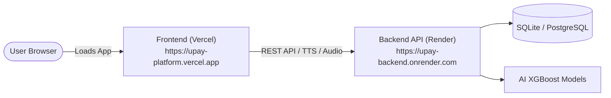

# Upay AI Financial Intelligence Platform — Cloud Deployment Guide

This guide details the best **100% FREE** solutions to deploy both the **FastAPI Backend** and **React/Vite Frontend** live on the cloud.

---

## 🏆 Recommended Solution: Render (Backend) + Vercel (Frontend)

This is the industry standard for fullstack web apps. Both platforms offer generous free tiers with automatic HTTPS (SSL), continuous deployment from GitHub, and global CDN.



---

### Step 1: Deploy Backend on Render (100% Free)

1. Go to [Render.com](https://render.com) and Sign In with your GitHub account.
2. Click **New +** -> **Web Service**.
3. Choose **Build and deploy from a Git repository**.
4. Select `mrmayan179/Upay_AI_Financial_Intelligence_Platform`.
5. Configure the service:
   - **Name**: `upay-ai-backend`
   - **Region**: Singapore or Frankfurt (or nearest to you)
   - **Branch**: `main`
   - **Runtime**: `Python 3`
   - **Build Command**: `pip install -r requirements.txt`
   - **Start Command**: `python -m uvicorn backend.main:app --host 0.0.0.0 --port $PORT`
   - **Plan**: `Free`
6. Click **Deploy Web Service**.
7. Once deployed, copy your backend URL (e.g., `https://upay-ai-backend.onrender.com`).
   - You can test it by visiting: `https://upay-ai-backend.onrender.com/docs`

> **Note on Render Free Tier**: Inactive services sleep after 15 minutes of inactivity and take ~30-50 seconds to wake up on the first request.

---

### Step 2: Deploy Frontend on Vercel (100% Free)

1. Go to [Vercel.com](https://vercel.com) and Sign In with GitHub.
2. Click **Add New...** -> **Project**.
3. Import your GitHub repository: `mrmayan179/Upay_AI_Financial_Intelligence_Platform`.
4. Configure Project Settings:
   - **Framework Preset**: `Vite`
   - **Root Directory**: Click *Edit* and select `frontend`
   - **Build Command**: `npm run build` (or leave default)
   - **Output Directory**: `dist` (default)
5. **Environment Variables**:
   - Add variable: `VITE_API_BASE_URL`
   - Value: `https://upay-ai-backend.onrender.com` *(your Render backend URL from Step 1)*
6. Click **Deploy**.
7. In ~60 seconds, your frontend will be live at `https://<your-project>.vercel.app`!

---

## ⚡ Alternative Solution 2: Single-Service All-In-One (Render)

If you prefer **one single URL** that serves both frontend and backend without configuring two separate services:

1. In Render, create a **Web Service** with:
   - **Runtime**: `Python 3`
   - **Build Command**:
     ```bash
     npm --prefix frontend install && npm --prefix frontend run build && pip install -r requirements.txt
     ```
   - **Start Command**:
     ```bash
     python -m uvicorn backend.main:app --host 0.0.0.0 --port $PORT
     ```
2. FastAPI automatically detects the `frontend/dist` directory and mounts the React app at `/`, while keeping the API at `/api/v1` and docs at `/docs`!

---

## 🐳 Alternative Solution 3: Hugging Face Spaces (Docker - Free 16GB RAM)

1. Go to [Hugging Face Spaces](https://huggingface.co/spaces).
2. Click **Create new Space**.
3. Choose **Docker** as Space SDK.
4. Push or connect this repository.
5. Hugging Face runs the Docker container with **16 GB RAM & 2 vCPUs completely free** without cold-start sleep limitations.

---

## 🔑 Demo Account Credentials

When testing your live application:
- **Phone Number**: `01771449164`
- **PIN**: `1234`
- **Account Holder**: `TANVIR KABIR`
