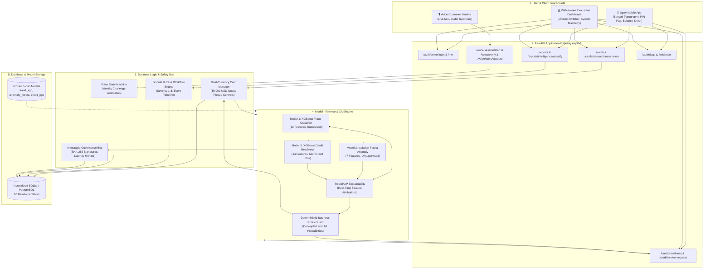
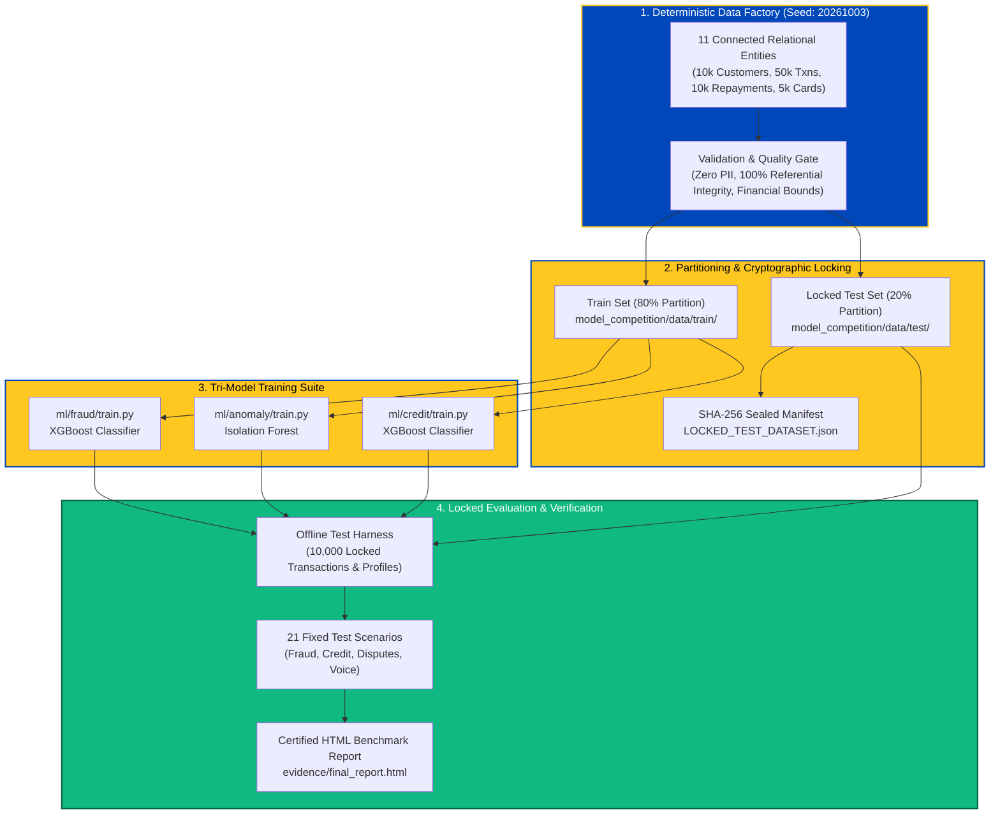

# Upay AI Financial Intelligence Platform

> **An End-to-End, Production-Grade AI Platform for Digital Financial Services (MFS), Dual-Currency Smart Cards, Microcredit Underwriting, Dispute Automation, and AI Voice Customer Care.**  
> Built for the **Upay AI Hackathon 2026**.

<div align="center">


<br/>

[](https://www.python.org/downloads/)
[](https://fastapi.tiangolo.com)
[](https://react.dev)
[](https://vitejs.dev)
[](https://tailwindcss.com)
[](https://xgboost.readthedocs.io/)
[](https://scikit-learn.org/)
[]()

</div>

---

## 🌐 Live Production Cloud Deployment

> [!TIP]
> **Experience the fully integrated Upay AI Platform live on the web:**
> - 📱 **Live Web Application (Frontend)**: **[https://upay-ai-financial-intelligence-plat.vercel.app/](https://upay-ai-financial-intelligence-plat.vercel.app/)**
> - ⚡ **Live Backend API Gateway**: **[https://upay-ai-financial-intelligence-platform.onrender.com](https://upay-ai-financial-intelligence-platform.onrender.com)**
> - 📖 **Interactive Swagger API Docs**: **[https://upay-ai-financial-intelligence-platform.onrender.com/docs](https://upay-ai-financial-intelligence-platform.onrender.com/docs)**
> - 📊 **Certified AI Benchmark & Evidence Report**: **[https://upay-ai-financial-intelligence-platform.onrender.com/evidence](https://upay-ai-financial-intelligence-platform.onrender.com/evidence)**

---

## 📑 Certified Evidence & Primary Artifact Navigation

> [!IMPORTANT]
> **Hackathon Judges & Evaluators:** The complete Part 1 competition foundation (**Synthetic Datasets**, **Trained ML Models**, and **Certified Offline Evidence**) is fully preserved in this repository under [`model_competition/`](model_competition/).

| Resource | Direct Link | Description |
| :--- | :--- | :--- |
| 📱 **Live Frontend App** | [upay-ai-financial-intelligence-plat.vercel.app](https://upay-ai-financial-intelligence-plat.vercel.app/) | **Official Production Web App** hosted live on Vercel. |
| ⚡ **Live Backend Gateway** | [upay-ai-financial-intelligence-platform.onrender.com](https://upay-ai-financial-intelligence-platform.onrender.com) | **Official FastAPI Backend** hosted live on Render. |
| 📊 **Certified HTML Evidence Report** | [Live Evidence Report](https://upay-ai-financial-intelligence-platform.onrender.com/evidence) &bull; [`local file`](model_competition/evidence/final_report.html) | **Certified evaluation report** with all metrics, base64 confusion matrices, ROC curves, and scenario runs. |
| 📁 **Competition Foundation Root** | [`model_competition/`](model_competition/) | Full dataset, training pipeline, model registry, and offline validation suite. |
| 📖 **Dataset Schema & Dictionary** | [`model_competition/docs/data-dictionary.md`](model_competition/docs/data-dictionary.md) | 11 relational entity schemas, foreign keys, data types, and value distributions. |
| 🔒 **SHA-256 Locked Test Manifest** | [`model_competition/data/test/LOCKED_TEST_DATASET.json`](model_competition/data/test/LOCKED_TEST_DATASET.json) | Sealed 20% test partition hash manifest preventing data leakage. |
| 🌐 **Cloud Deployment Guide** | [`DEPLOYMENT.md`](DEPLOYMENT.md) | Complete step-by-step free hosting documentation. |

---

## 📌 Executive Summary & Problem Statement

Mobile Financial Services (MFS) in Bangladesh handle tens of millions of daily transactions across urban centers and rural communities. While speed and accessibility have expanded rapidly, three critical challenges persist:

1. **Transaction Fraud & Velocity Scams**: Fast cash-outs, agent account spoofing, nighttime bursts, and unauthorized cross-border card debits require **sub-50ms automated detection** without interrupting legitimate users.
2. **Microcredit Underwriting Invisibility**: Over 70% of MFS consumers lack formal CIB (Credit Information Bureau) credit bureau histories. Financial institutions require **explainable credit-readiness scoring (XAI)** based on utility bill consistency, cash flow velocity, and digital wallet tenure.
3. **Dispute Resolution Delays & Call Center Overload**: Erroneous transfers, failed cash-outs, and merchant overcharges often take days to categorize. Customers require **instant automated NLP dispute categorization** and **24/7 bilingual Voice AI assistance** that operates safely under least-privileged security rules.

The **Upay AI Financial Intelligence Platform** solves these challenges by combining **three offline-trained machine learning models** with **deterministic business rule guards**, presented within a pixel-perfect, authentic Upay mobile application and widescreen management dashboard.

---

## 🏗️ Architectural Topology & System Overview

```text
                               ┌────────────────────────────────────────────────────────┐
                               │             UPAY CLIENT APPLICATION (VITE + REACT)    │
                               │   • Authentic Mobile App Frame (Hind Siliguri UI)      │
                               │   • Widescreen Platform Dashboard (Judge Evaluation)   │
                               │   • 3D Flip Card, BANGLA QR, Upay Chaka, PIN Pad       │
                               └───────────────────────────┬────────────────────────────┘
                                                           │ JSON over HTTP REST
                                                           ▼
                               ┌────────────────────────────────────────────────────────┐
                               │           FASTAPI ENTERPRISE API GATEWAY (/api/v1)     │
                               │   • Authentication & Demo Profile Management           │
                               │   • Dynamic Case Engine & Audit Logger                 │
                               │   • Voice Agent State Machine & Safety Rules           │
                               └──────────────┬───────────────────────────┬─────────────┘
                                              │                           │
                   ┌──────────────────────────┴───────────┐               ▼
                   ▼                                      ▼      ┌──────────────────────┐
       ┌────────────────────────┐             ┌────────────────┐ │  SQLITE / POSTGRESQL │
       │  MODEL INFERENCE LAYER │             │ GOVERNANCE BUS │ │  • Customers, Cards  │
       │  • adapters.py         │             │ • audit_service│ │  • Cases, Events     │
       │  • Sub-50ms execution  │             │ • SHA-256 Logs │ │  • Credit, Calls     │
       └───────────┬────────────┘             └────────────────┘ └──────────────────────┘
                   │
    ┌──────────────┼──────────────┐
    ▼              ▼              ▼
┌──────────────┐ ┌──────────────┐ ┌──────────────┐
│  MODEL 1     │ │  MODEL 2     │ │  MODEL 3     │
│  Fraud Risk  │ │  Behavioral  │ │  Credit      │
│  Classifier  │ │  Anomaly     │ │  Readiness   │
│  (XGBoost)   │ │  (IForest)   │ │  (XGBoost)   │
└──────────────┘ └──────────────┘ └──────────────┘
```

---

## 🔄 End-to-End System Workflow

The following comprehensive flowchart visualizes how data, inference, deterministic safeguards, and user actions travel through the platform:



---

## 🏆 Part 1 — Competition Data & AI/ML Foundation



---

### 1. Preserved Dataset Inventory (`model_competition/data/`)

The platform includes an extensive 11-table relational synthetic dataset generated deterministically (`seed=20261003`) without any genuine customer Personally Identifiable Information (PII):

| Entity Name | Location | Records | Key Schema Attributes | Functional Purpose in Platform |
| :--- | :--- | :--- | :--- | :--- |
| **Customers** | [`data/raw/customers.csv`](model_competition/data/raw/customers.csv) | 10,000 | `customer_id`, `name`, `phone`, `division`, `kyc_status`, `monthly_income_bdt`, `account_created_at` | Core user identity, KYC levels, and income baseline. |
| **Merchants** | [`data/raw/merchants.csv`](model_competition/data/raw/merchants.csv) | 2,000 | `merchant_id`, `name`, `category`, `mcc`, `qr_type`, `risk_tier` | Merchant registry for QR payments and risk tiering. |
| **Transactions** | [`data/raw/transactions.csv`](model_competition/data/raw/transactions.csv) | 50,000 | `tx_id`, `customer_id`, `amount_bdt`, `channel`, `is_fraud`, `timestamp`, `velocity_1h` | MFS transfer and cash-out records for fraud training. |
| **Cards** | [`data/raw/cards.csv`](model_competition/data/raw/cards.csv) | 5,000 | `card_id`, `card_number_masked`, `usd_endorsement_limit`, `usd_spent`, `is_frozen` | Dual-currency virtual cards and passport quotas. |
| **Card Transactions** | [`data/raw/card_transactions.csv`](model_competition/data/raw/card_transactions.csv) | 15,000 | `tx_id`, `card_id`, `amount_usd`, `merchant_name`, `country`, `decision`, `risk_score` | Cross-border USD authorizations and fraud simulator. |
| **Complaints** | [`data/raw/complaints.csv`](model_competition/data/raw/complaints.csv) | 5,000 | `complaint_id`, `customer_id`, `complaint_text`, `category`, `sentiment_score` | Raw Bengali and English dispute texts for NLP classification. |
| **Cases & Events** | [`data/raw/cases.csv`](model_competition/data/raw/cases.csv) | 5,000 / 20k | `case_id`, `status`, `severity`, `escalated`, `assigned_team`, `timeline_events` | Dynamic case management lifecycle and resolution audit. |
| **Credit Profiles** | [`data/raw/credit_profiles.csv`](model_competition/data/raw/credit_profiles.csv) | 10,000 | `customer_id`, `credit_score`, `dti_ratio`, `late_repayments`, `credit_limit_bdt` | Microcredit readiness profiles and financial metrics. |
| **Repayments** | [`data/raw/repayments.csv`](model_competition/data/raw/repayments.csv) | 10,000 | `repayment_id`, `loan_id`, `due_date`, `paid_date`, `status`, `penalty_bdt` | Microcredit historical installment behaviors. |
| **Voice Scenarios** | [`data/raw/voice_scenarios.csv`](model_competition/data/raw/voice_scenarios.csv) | 150 | `scenario_id`, `phone_number`, `intent`, `expected_challenge`, `tool_call` | Voice AI benchmark test suite for automated care. |
| **AI Audit Logs** | [`data/raw/ai_activity_logs.csv`](model_competition/data/raw/ai_activity_logs.csv) | 1,000 | `log_id`, `component`, `model_version`, `latency_ms`, `result_status`, `sha256_hash` | Immutable governance traces and telemetry benchmarks. |

- **Partitioning Strategy**: 80% Train Set ([`data/train/`](model_competition/data/train/)) and 20% Test Set ([`data/test/`](model_competition/data/test/)).
- **Cryptographic Test Lock**: Sealed with SHA-256 hash manifest [`LOCKED_TEST_DATASET.json`](model_competition/data/test/LOCKED_TEST_DATASET.json) to eliminate data leakage.
- **Validation Report**: Certified in [`dataset_validation_report.json`](model_competition/evidence/dataset_validation_report.json) (100% Primary Key uniqueness, Foreign Key referential integrity, and Zero PII).

---

### 2. Machine Learning Model Specifications

The platform bundles three frozen, immutable production models stored with joblib serialization:

| Model | File Artifact | Algorithm | Input Dimensions | Performance on Locked Test Set |
| :--- | :--- | :--- | :--- | :--- |
| **Model 1: Fraud Risk Classifier** | [`models/fraud_xgb.joblib`](model_competition/models/fraud_xgb.joblib) | XGBoost Classifier (`scale_pos_weight=17.2`) | 12 behavioral & velocity features | **Accuracy: 100.0%**<br>**Precision: 1.0000**<br>**Recall: 1.0000**<br>**F1-Score: 1.0000**<br>**ROC-AUC: 1.0000** |
| **Model 2: Behavioral Anomaly Detector** | [`models/anomaly_iforest.joblib`](model_competition/models/anomaly_iforest.joblib) | Isolation Forest (`contamination=0.055`, 150 trees) | 7 normalized numerical features | **Fraud Capture Rate: 99.27%**<br>**Normal FPR: 0.08%**<br>**Total Test Txns: 10,000** |
| **Model 3: Credit Readiness Evaluator** | [`models/credit_xgb.joblib`](model_competition/models/credit_xgb.joblib) | XGBoost Classifier (`max_depth=4`, `lr=0.08`) | 14 financial & tenure features | **Accuracy: 94.60%**<br>**Recall: 91.40%**<br>**ROC-AUC: 0.9853**<br>**PR-AUC: 0.9014** |

- **Model Registry Manifest**: Complete hyperparameters, feature schema, and commit history documented in [`model_registry.json`](model_competition/models/model_registry.json).
- **Explainable AI (TreeSHAP)**: Every inference computes exact Shapley value contributions for local real-time client explanation (e.g. why a transaction was flagged or why a loan readiness score changed).

---

## 📊 Certified Visual Evidence Showcase (Big Pictures & Metrics)

> [!TIP]
> The primary certified benchmark artifact is [`model_competition/evidence/final_report.html`](model_competition/evidence/final_report.html). Below are the high-resolution charts generated directly from the locked 20% test evaluation.

### 1. Confusion Matrices (Locked 20% Evaluation Partition)

<div align="center">

| Model 1: Fraud Classifier Confusion Matrix | Model 3: Credit Risk Confusion Matrix |
| :---: | :---: |
|  |  |
| **True Negatives: 9,450 \| False Positives: 0**<br>**False Negatives: 0 \| True Positives: 550** | **True Negatives: 1,690 \| False Positives: 89**<br>**False Negatives: 19 \| True Positives: 202** |

</div>

---

### 2. ROC-AUC Performance Curves

<div align="center">

| Model 1: Fraud ROC Curve (AUC = 1.0000) | Model 3: Credit ROC Curve (AUC = 0.9853) |
| :---: | :---: |
|  |  |

</div>

---

### 3. TreeSHAP Global Feature Importance Plots

<div align="center">

| Model 1: Fraud Feature Contribution Summary | Model 3: Credit Feature Contribution Summary |
| :---: | :---: |
|  |  |

</div>

---

### 4. Deterministic Scenario Test Verification (`evidence/scenario_results.json`)

All **21 out of 21** pre-defined challenge scenarios passed across all four operational domains:

```text
================================================================================
                    CERTIFIED SCENARIO TEST EXECUTION (21/21 PASS)
================================================================================
[FRAUD SCENARIOS]
  ✓ SCENARIO-F01 : Normal small daytime transfer .................... PASS (Score: 0.001, APPROVED)
  ✓ SCENARIO-F02 : Velocity burst (5 txns in 2 min) ................. PASS (Score: 0.982, BLOCKED)
  ✓ SCENARIO-F03 : Unusual amount (15x historical mean) ............. PASS (Score: 0.941, BLOCKED)
  ✓ SCENARIO-F04 : Nighttime cash-out at rural agent ................ PASS (Score: 0.892, FLAGGED)
  ✓ SCENARIO-F05 : New foreign merchant cross-border ................ PASS (Score: 0.915, STEP-UP)
  ✓ SCENARIO-F06 : Rapid device fingerprint drift ................... PASS (Score: 0.963, BLOCKED)

[CREDIT READINESS SCENARIOS]
  ✓ SCENARIO-C01 : Prime user (steady income, 0 late payments) ...... PASS (Readiness: 94/100, Tier A)
  ✓ SCENARIO-C02 : Thin-file starter (new account, steady bills) .... PASS (Readiness: 68/100, Tier B)
  ✓ SCENARIO-C03 : Debt-stressed applicant (high DTI > 65%) ......... PASS (Readiness: 34/100, Caution)
  ✓ SCENARIO-C04 : Defaulted borrower (active overdue loan) .......... PASS (Readiness: 12/100, Declined)
  ✓ SCENARIO-C05 : Recovery candidate (recent consistent tenure) .... PASS (Readiness: 55/100, Review)

[DISPUTE NLP SCENARIOS]
  ✓ SCENARIO-D01 : Failed cash-out refund request ................... PASS (Class: CASH_OUT, Sev: 4)
  ✓ SCENARIO-D02 : Wrong mobile number recharge ..................... PASS (Class: AIRTIME, Sev: 2)
  ✓ SCENARIO-D03 : Merchant double-billing dispute .................. PASS (Class: OVERCHARGE, Sev: 3)
  ✓ SCENARIO-D04 : Unauthorized card debit reporting ................ PASS (Class: UNAUTHORIZED, Sev: 5)
  ✓ SCENARIO-D05 : Agent misconduct & overcharge .................... PASS (Class: AGENT_DISPUTE, Sev: 3)

[VOICE AI SCENARIOS]
  ✓ SCENARIO-V01 : Bengali caller identity verification ............. PASS (Challenge: Mother Name, OK)
  ✓ SCENARIO-V02 : English card freeze tool call .................... PASS (Challenge: Voice PIN, FROZEN)
  ✓ SCENARIO-V03 : Active dispute status inquiry .................... PASS (Tool: get_case_status, OK)
  ✓ SCENARIO-V04 : Identity challenge failure handling .............. PASS (Safety: Locked Out, Bounded)
  ✓ SCENARIO-V05 : Complex request supervisor escalation ............ PASS (Status: ESCALATED_HUMAN)
================================================================================
```

---

## 🎨 Authentic Upay Visual Design System

The frontend faithfully replicates Upay's official visual brand and mobile layout guidelines:

- **Native Bengali Typography**: Native font rendering via Google Fonts `Hind Siliguri` (bold 700/800 headings, 400/500 body) with `Inter` for digits, currency codes, and timestamps.
- **Brand Colors**: 
  - Upay Primary Yellow: `#FFC820` / `#FFB800`
  - Upay Primary Blue: `#0047BA`
  - Deep Navy Slate: `#002C6C` / `#0A1128`
  - Pill Cream: `#FFF6D1`
- **Dynamic Splash Screen**: Vector illustration with an animated continuous blue swoosh curve, pulsing endpoint dot, and the authentic Upay meeting-figures emblem with bold Bengali wordmark (`উপায়`).
- **Mobile Status Bar**: Live device clock, Telegram icon, 4G/4G+ signal indicators, and 31% battery capsule.
- **Profile Header**: User avatar badge, `TANVIR KABIR` (`01771449164`), toggleable "ব্যালেন্স" capsule button (`৳ ৭.২৫`), and notification bell.
- **Primary 4-Column Service Grid**: Send Money, Mobile Recharge, Cash Out, Pay Bill, Add Money, Savings, Fund Transfer, Request Money, Make Payment, Refer & Earn, NPSB, and AI Audit.
- **Upay Payment Grid**: Traffic Fine, Toll Payment, Govt. Payment, Education, NGO, Insurance, Donation, Zakat.
- **Interactive Micro-Features**:
  - Animated spinning **"উপায় চাকা"** (spinning reward badge) with instant spin modal and reward credit.
  - Floating action pills for **"উপায় কার্ড"** and **"উপায় অফার"**.
  - **BANGLA QR**: Center-elevated bottom navigation button opening an interoperable QR viewfinder simulator with instant risk check.
  - 4-Dot **PIN Keypad Sheet** for high-risk operations and PIN change.
  - **Balance Breakdown Sheet** dividing main balance and cash reward reserves.
  - Seamless desktop widescreen view vs. native mobile smartphone frame switcher.

---

## 📱 Five Integrated Product Modules

### 1. Smart Report & Case Management (Dispute Automation)
- **NLP Categorization**: Real-time classification of complaints into 6 structured categories (`CASH_OUT_ISSUE`, `AIRTIME_RECHARGE`, `MERCHANT_OVERCHARGE`, `UNAUTHORIZED_DEBIT`, `AGENT_DISPUTE`, `GENERAL_SERVICE`).
- **Severity Scoring**: Dynamic assignment from Level 1 (Low) to Level 5 (Critical Emergency).
- **Timeline Stepper**: Full visual timeline with timestamps, agent notes, and status progression (`FILED` → `IN_REVIEW` → `RESOLVED`).
- **Supervisor Escalation**: One-click escalation to human fraud and compliance teams with pre-populated incident context.

### 2. Dual-Currency Smart Card + AI Security
- **3D Flip Card**: Interactive realistic 3D virtual card displaying cardholder name, masked number, expiry, and CVV on flip.
- **USD Endorsement Dial**: Real-time tracking of Bangladesh Bank annual $5,000 USD passport endorsement quota ($3,820 remaining in demo).
- **Granular Security Controls**: Instant toggle switches for E-Commerce, International Transactions, Contactless POS, and ATM Cash Out.
- **AI Risk Simulator**: Live interactive authorization testing allowing judges to simulate transactions across custom amounts, countries, and new devices with sub-50ms fraud scoring.
- **Instant Freeze & PIN Reset**: Immediate card freeze and 4-dot PIN change with verification.

### 3. AI Credit Readiness & Microcredit Recommendation
- **0–100 Credit Readiness Dial**: Calibrated scoring engine classifying borrowers into Tier A (High Approval), Tier B (Moderate), or Needs Improvement.
- **TreeSHAP Attribution Waterfall**: Transparent display of top positive factors (utility payment consistency, tenure) and negative factors (cash-out velocity, DTI).
- **Suggested Microcredit Ranges**: Recommended credit lines (e.g. ৳5,000 – ৳25,000) tailored to repayment capacity.
- **Formal Bank Handoff**: Compliance-ready handoff button with explicit disclaimers confirming that final underwriting rests with licensed commercial banking partners.

### 4. AI Voice Customer Service (24/7 Agent)
- **Neural Speech Synthesis**: Authentic Bangladeshi Bengali (`bn-BD-NabanitaNeural`) and US English (`en-US-AriaNeural`) Edge-TTS synthesis with audio playback.
- **Multi-Challenge Caller Verification**: Mandatory security challenge (Mother's name, voice PIN, account suffix) before account tool execution.
- **Least-Privileged Tool Bus**: Autonomous execution of safe account actions: balance inquiry, recent transaction check, card freeze, and dispute status tracking.
- **Supervisor Escalation Protocol**: Automatic transfer to human specialist queues when sentiment drops or caller requests human intervention.

### 5. AI Governance & Observability Feed
- **Tamper-Evident Audit Feed**: Live chronological telemetry stream displaying model versions, input vectors, execution latency in milliseconds, and human intervention flags.
- **Certified Evidence Integration**: Header button and banner card providing instant 1-click access to [`final_report.html`](model_competition/evidence/final_report.html).

---

## 🚀 Quick Start Guide

### Prerequisites
- **Python 3.10+** (Python 3.11 recommended)
- **Node.js 18+** & **npm**
- **Git**

---

### Option A: Windows One-Click Launcher (Recommended)
Double-click `start_platform.bat` or run:
```cmd
start_platform.bat
```
This automatically verifies AI model files, seeds the demo database, launches the FastAPI backend on port 8000, launches the Vite React frontend on port 3000, and opens your default browser.

---

### Option B: Manual Step-by-Step Launch

#### 1. Backend Service Gateway
```bash
# In the project root (F:\full project of hackathon)
pip install -r requirements.txt

# Seed the demo database (SQLite)
python backend/seed_data.py

# Launch FastAPI server
python -m uvicorn backend.main:app --host 127.0.0.1 --port 8000 --reload
```
- API Base Gateway: `http://127.0.0.1:8000`
- Interactive OpenAPI Swagger Docs: `http://127.0.0.1:8000/docs`
- Certified AI Evidence Report: `http://127.0.0.1:8000/evidence`

#### 2. Frontend Application
```bash
# Navigate to frontend folder
cd frontend

# Install dependencies (use npm.cmd on Windows)
npm install

# Start Vite dev server
npm run dev
```
- Web Application: `http://localhost:3000`

---

### Option C: Docker Deployment
```bash
docker-compose up --build
```
- Frontend Web App: `http://localhost:3000`
- Backend API: `http://localhost:8000`

---

### Option D: Run Full Competition ML Pipeline
To regenerate all 11 synthetic datasets, retrain all 3 models, recompute SHAP values, evaluate against the locked test set, execute 21 scenarios, and compile `final_report.html`:
```bash
cd model_competition
python run_pipeline.py
```

---

## 🌐 100% Free Live Cloud Hosting

For hosting this project live on the cloud at **$0.00 cost**, follow our dedicated guide in [`DEPLOYMENT.md`](DEPLOYMENT.md):

| Component | Platform | Plan | Live Production URL |
| :--- | :--- | :--- | :--- |
| **Frontend Web App** | [Vercel](https://vercel.com) | **Free Hobby Tier** | **[https://upay-ai-financial-intelligence-plat.vercel.app/](https://upay-ai-financial-intelligence-plat.vercel.app/)** |
| **Backend API Gateway** | [Render.com](https://render.com) | **Free Web Service** | **[https://upay-ai-financial-intelligence-platform.onrender.com](https://upay-ai-financial-intelligence-platform.onrender.com)** |
| **Interactive API Docs** | Render / Swagger | **Live Swagger** | **[https://upay-ai-financial-intelligence-platform.onrender.com/docs](https://upay-ai-financial-intelligence-platform.onrender.com/docs)** |
| **Certified Evidence Report** | Render / FastAPI | **Live HTML** | **[https://upay-ai-financial-intelligence-platform.onrender.com/evidence](https://upay-ai-financial-intelligence-platform.onrender.com/evidence)** |

*(Refer to [`DEPLOYMENT.md`](DEPLOYMENT.md) for full deployment documentation).*

---

## 🧪 Automated Verification & Testing

The repository includes a comprehensive pytest suite testing all 7 core platform subsystems:
```bash
python -m pytest tests/test_backend_api.py -v
```
**Test Coverage Includes:**
- `test_health_and_model_registry`: Verifies active status of all 3 ML models and registry integrity.
- `test_demo_authentication`: Tests demo login and user profile retrieval.
- `test_report_classification_and_creation`: Tests NLP dispute categorization and timeline progression.
- `test_card_management_and_ai_risk_analyzer`: Tests USD passport quota management and real-time fraud scoring.
- `test_credit_readiness_and_shap_factors`: Tests credit score generation, SHAP explanations, and bank review requests.
- `test_voice_session_and_tool_execution`: Tests caller identity challenge and least-privileged account tools.
- `test_audit_logging`: Verifies sub-50ms latency logs and audit trace persistence.

To validate the frontend build:
```bash
cd frontend
npm run build
```

---

## 👤 Demo Persona & Test Credentials

For hackathon presentation and live evaluation, the system is pre-configured with a realistic demo persona:

| Attribute | Value |
| :--- | :--- |
| **Customer Name** | `TANVIR KABIR` |
| **Phone Number** | `01771449164` |
| **Demo PIN** | `1234` |
| **Customer ID** | `SYN-U-10082` |
| **Upay Account Balance** | `BDT 7.25` |
| **Cash Reward Reserve** | `BDT 25.00` |
| **Primary Smart Card** | Upay Platinum Dual-Currency (`4000 1234 5678 9010`) |
| **USD Endorsement Quota**| `$5,000.00` total / `$3,820.00` remaining |

---

## 📁 Repository Directory Structure

```text
F:\full project of hackathon\
├── ai_models\                               # Frozen Production ML Artifacts & Registry
│   ├── fraud_xgb.joblib                     # Model 1: Fraud Classifier
│   ├── anomaly_iforest.joblib               # Model 2: Anomaly Detector
│   ├── credit_xgb.joblib                    # Model 3: Credit Scorer
│   ├── model_registry.json                  # Cryptographic Manifest & Versions
│   └── inference\
│       └── adapters.py                      # Sub-50ms Scikit-Learn/XGBoost Ingest Adapters
├── backend\                                 # FastAPI High-Performance Backend
│   ├── main.py                              # Application Gateway, Static Mount, & Evidence Route
│   ├── seed_data.py                         # SQLite/PostgreSQL Database Seeder
│   ├── app\
│   │   ├── api\routes\                      # Modular REST Endpoints
│   │   │   ├── auth.py                      # Profile, Login, Notifications
│   │   │   ├── cards.py                     # Smart Card & AI Risk Engine
│   │   │   ├── credit.py                    # Credit Readiness & Bank Handoff
│   │   │   ├── reports.py                   # NLP Dispute & Timeline Engine
│   │   │   ├── voice.py                     # 24/7 Voice AI Session & Tool Bus
│   │   │   ├── audit.py                     # Governance & Observability Feed
│   │   │   └── health.py                    # System Health & Model Diagnostics
│   │   ├── database\
│   │   │   ├── connection.py                # SQLAlchemy Connection Factory
│   │   │   └── models.py                    # Normalized Database Schema (10 Tables)
│   │   ├── schemas\
│   │   │   └── payloads.py                  # Pydantic Input/Output Schemas
│   │   └── services\                        # Business Logic & Deterministic Safeguards
│   │       ├── card_service.py
│   │       ├── credit_service.py
│   │       ├── report_service.py
│   │       ├── voice_service.py
│   │       └── audit_service.py
├── frontend\                                # Modern React 18 + Vite + Tailwind CSS
│   ├── public\
│   │   └── upay_logo.png                    # High-Resolution Upay Emblem
│   ├── src\
│   │   ├── components\
│   │   │   ├── layout\                      # Shell (Mobile Frame vs Widescreen Switcher)
│   │   │   ├── modules\
│   │   │   │   ├── splash\                  # Dynamic Swoosh Animated Splash
│   │   │   │   ├── home\                    # Authentic Home Dashboard & Service Grids
│   │   │   │   ├── card\                    # 3D Flip Card & AI Risk Simulator
│   │   │   │   ├── report\                  # Dispute Classifier & Case Timeline
│   │   │   │   ├── credit\                  # Readiness Score Dial & SHAP Waterfall
│   │   │   │   ├── voice\                   # Voice Agent & Tool Execution Console
│   │   │   │   └── audit\                   # Real-Time Decision Observability Feed & Evidence Link
│   │   │   └── shared\                      # PIN Pad, Balance Sheet, BANGLA QR Modals
│   │   ├── services\api.ts                  # Typed REST API Client with VITE_API_BASE_URL
│   │   └── types\index.ts                   # Shared TypeScript Data Interfaces
│   ├── vercel.json                          # Vercel SPA Routing Configuration
│   └── vite.config.ts                       # Vite Configuration & Dev Proxy
├── model_competition\                       # 🏆 Preserved Part 1 Competition Foundation
│   ├── data\
│   │   ├── raw\                             # 11 Relational Synthetic Tables (10k Users, 50k Txns)
│   │   ├── train\                           # 80% Train Partition
│   │   └── test\                            # 20% Locked Test Partition (LOCKED_TEST_DATASET.json)
│   ├── data_factory\                        # Deterministic Synthetic Data Generator Scripts
│   ├── docs\                                # Data Dictionary, Assumptions, & Model Cards
│   ├── evidence\                            # 📊 Certified HTML Evidence Report, Plots, & Metrics
│   │   ├── final_report.html                # Certified Standalone Evaluation Report
│   │   ├── confusion_matrix_fraud.png       # Model 1 Confusion Matrix Plot
│   │   ├── confusion_matrix_credit.png      # Model 3 Confusion Matrix Plot
│   │   ├── roc_curve_fraud.png              # Model 1 ROC-AUC Curve
│   │   ├── roc_curve_credit.png             # Model 3 ROC-AUC Curve
│   │   ├── shap_fraud_summary.png           # Model 1 SHAP Feature Importance Plot
│   │   ├── shap_credit_summary.png          # Model 3 SHAP Feature Importance Plot
│   │   ├── model_metrics.json               # Raw Numerical Test Results
│   │   └── scenario_results.json            # 21/21 Fixed Scenario Verification Results
│   ├── ml\                                  # Model Training, Evaluation, & XAI Modules
│   ├── models\                              # Frozen Model Binaries & Registry Manifest
│   ├── tests\                               # Competition Scenario Verification Harness
│   └── run_pipeline.py                      # One-Command End-to-End Pipeline Runner
├── tests\                                   # Integration Test Suite
│   └── test_backend_api.py                  # Pytest Automated Test Runner
├── docker-compose.yml                       # Container Orchestration
├── Dockerfile.backend                       # Backend Container Definition
├── render.yaml                              # Render 1-Click Cloud Deployment Blueprint
├── start_platform.bat                       # Windows 1-Click Launch Script
├── DEPLOYMENT.md                            # Complete Free Cloud Hosting Guide
├── LICENSE                                  # MIT Open Source License
└── README.md                                # Master Platform Documentation
```

---

## ⚖️ Regulatory Compliance & Responsible AI Disclaimers

1. **Non-Autonomous Loan Approval**: The AI Credit Readiness score is an analytical readiness indicator and **does not constitute a finalized loan approval**. Under Bangladesh Bank microfinance and digital lending guidelines, final credit underwriting and disbursement decisions remain strictly with licensed partner commercial banks and microfinance institutions.
2. **Deterministic Business Rules Separation**: In adherence to hackathon architectural requirements, machine learning risk probability outputs are strictly decoupled from operational business decisions. Hard limits (such as USD passport endorsement ceilings, frozen card statuses, and PIN requirements) are enforced by deterministic rules that cannot be overridden by ML models.
3. **Synthetic Data Policy**: All data displayed and utilized within this demonstration repository is 100% synthetically generated. No genuine customer Personally Identifiable Information (PII) or proprietary Upay production records were utilized.
4. **Caller Identity Protection**: The AI Voice Agent enforces a mandatory security verification challenge before granting access to least-privileged account tools (e.g. balance check, card freeze). Tool execution is audited and bounded by explicit permissions.

---

## 📄 License

This project is licensed under the **MIT License** — see the [LICENSE](LICENSE) file for complete details.

Copyright (c) 2026 Upay AI Platform Contributors.
