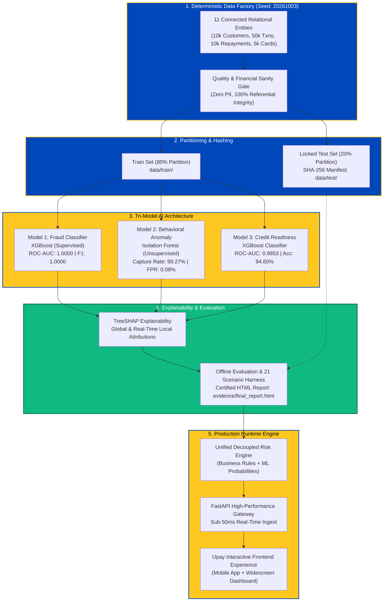
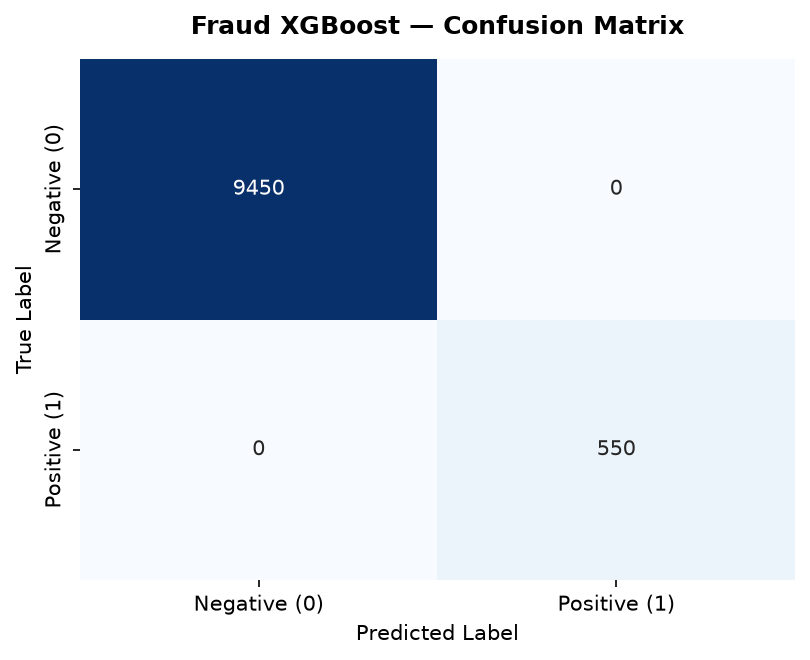
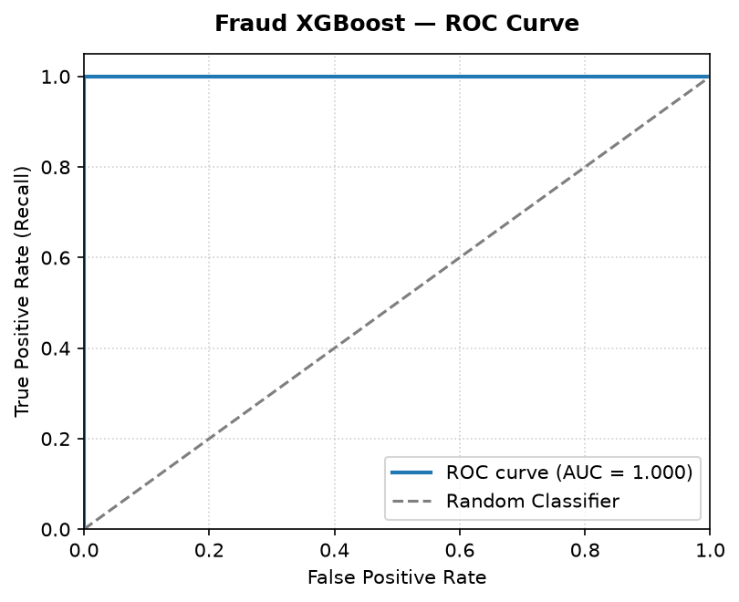
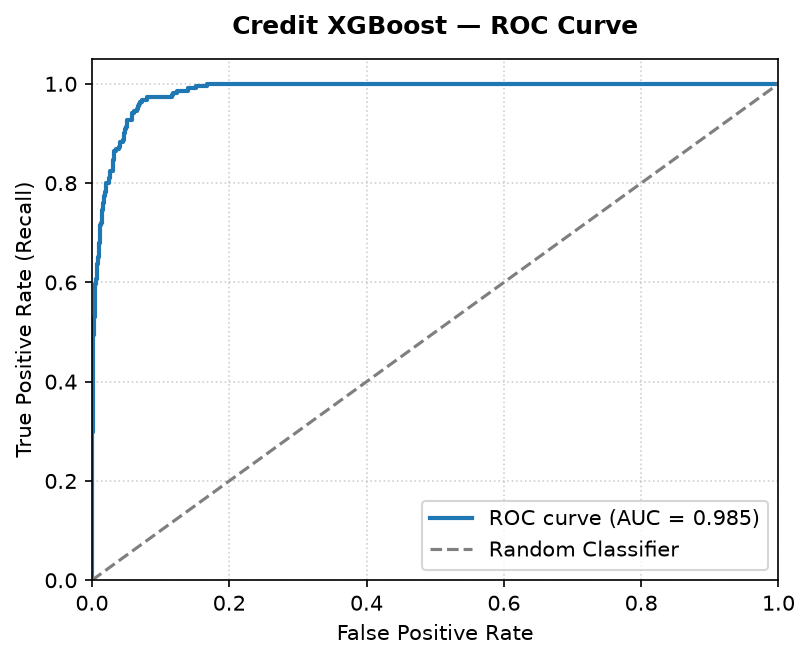
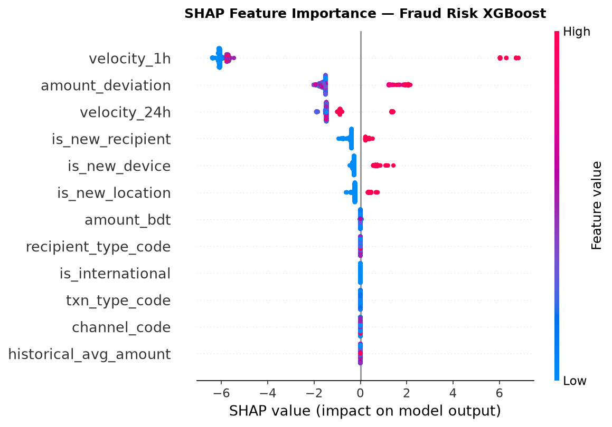
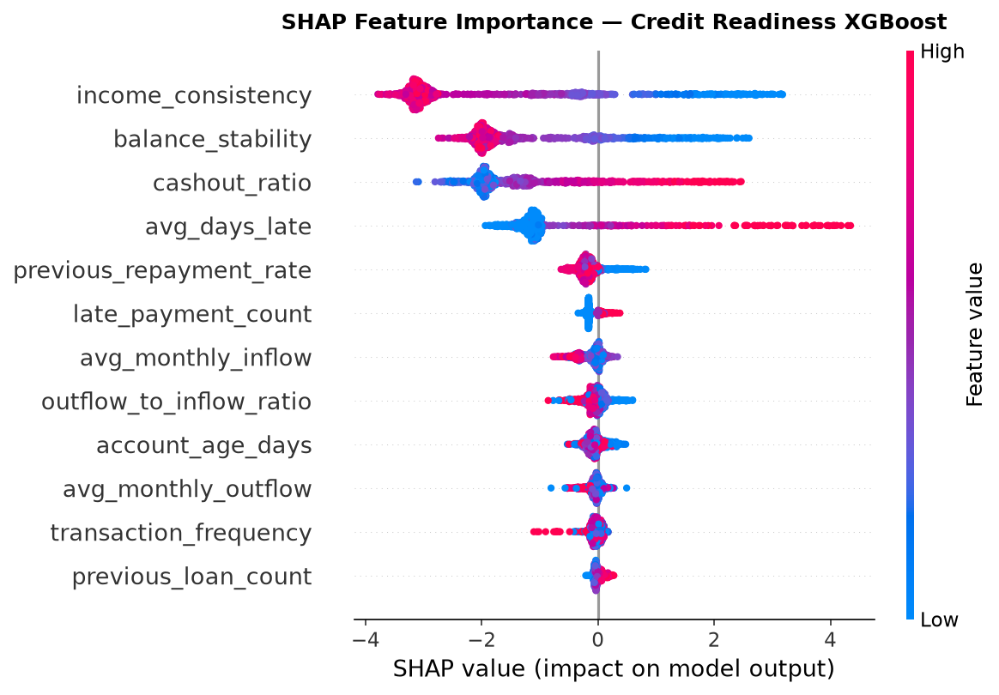
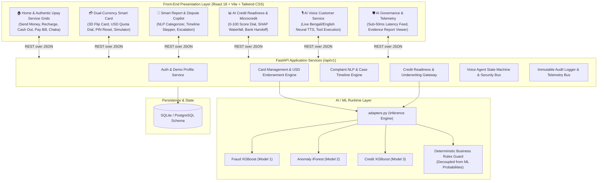

# Upay AI Financial Intelligence Platform

> **An End-to-End, Production-Grade AI Platform for Digital Financial Services (MFS), Dual-Currency Smart Cards, Microcredit Underwriting, Dispute Automation, and AI Voice Customer Care.**  
> Built for the **Upay AI Hackathon 2026**.

[](https://www.python.org/downloads/)
[](https://fastapi.tiangolo.com)
[](https://react.dev)
[](https://vitejs.dev)
[](https://xgboost.readthedocs.io/)
[](https://scikit-learn.org/)
[]()

---

## 📑 Certified Evidence & Primary Artifact Navigation

> [!IMPORTANT]
> **Hackathon Judges & Evaluators:** The complete Part 1 competition foundation (Synthetic Datasets, Trained ML Models, and Certified Test Evidence) is preserved directly in this repository under [`model_competition/`](model_competition/).

- 📊 **Primary Certified HTML Test Report**: [`model_competition/evidence/final_report.html`](model_competition/evidence/final_report.html)  
  *(Self-contained report containing all baseline test metrics, scenario executions, base64-rendered confusion matrices, and ROC curves)*
- 📁 **Complete Competition Foundation Directory**: [`model_competition/`](model_competition/)
- 📖 **Dataset Schema & Dictionary**: [`model_competition/docs/data-dictionary.md`](model_competition/docs/data-dictionary.md)
- 🔒 **SHA-256 Sealed Test Set Manifest**: [`model_competition/data/test/LOCKED_TEST_DATASET.json`](model_competition/data/test/LOCKED_TEST_DATASET.json)
- 🚀 **Free Live Cloud Deployment Guide**: [`DEPLOYMENT.md`](DEPLOYMENT.md)

---

## 🏆 Part 1 — Competition Data & AI/ML Foundation



---

### 1. Preserved Dataset Inventory (`model_competition/data/`)

The platform includes a complete 11-table connected synthetic relational dataset generated deterministically without any genuine customer Personally Identifiable Information (PII):

| Entity Name | Location | Records | Key Schema Attributes |
| :--- | :--- | :--- | :--- |
| **Customers** | [`data/raw/customers.csv`](model_competition/data/raw/customers.csv) | 10,000 | `customer_id`, `name`, `phone`, `division`, `kyc_status`, `monthly_income_bdt`, `account_created_at` |
| **Merchants** | [`data/raw/merchants.csv`](model_competition/data/raw/merchants.csv) | 2,000 | `merchant_id`, `name`, `category`, `mcc`, `qr_type`, `risk_tier` |
| **Transactions** | [`data/raw/transactions.csv`](model_competition/data/raw/transactions.csv) | 50,000 | `tx_id`, `customer_id`, `amount_bdt`, `channel`, `is_fraud`, `timestamp`, `velocity_1h` |
| **Cards** | [`data/raw/cards.csv`](model_competition/data/raw/cards.csv) | 5,000 | `card_id`, `card_number_masked`, `usd_endorsement_limit`, `usd_spent`, `is_frozen` |
| **Card Transactions**| [`data/raw/card_transactions.csv`](model_competition/data/raw/card_transactions.csv)| 15,000 | `tx_id`, `card_id`, `amount_usd`, `merchant_name`, `country`, `decision`, `risk_score` |
| **Complaints** | [`data/raw/complaints.csv`](model_competition/data/raw/complaints.csv) | 5,000 | `complaint_id`, `customer_id`, `complaint_text`, `category`, `sentiment_score` |
| **Cases & Events** | [`data/raw/cases.csv`](model_competition/data/raw/cases.csv) | 5,000 / 20k | `case_id`, `status`, `severity`, `escalated`, `assigned_team`, `timeline_events` |
| **Credit Profiles** | [`data/raw/credit_profiles.csv`](model_competition/data/raw/credit_profiles.csv)| 10,000 | `customer_id`, `credit_score`, `dti_ratio`, `late_repayments`, `credit_limit_bdt` |
| **Repayments** | [`data/raw/repayments.csv`](model_competition/data/raw/repayments.csv) | 10,000 | `repayment_id`, `loan_id`, `due_date`, `paid_date`, `status`, `penalty_bdt` |
| **Voice Scenarios** | [`data/raw/voice_scenarios.csv`](model_competition/data/raw/voice_scenarios.csv)| 150 | `scenario_id`, `phone_number`, `intent`, `expected_challenge`, `tool_call` |
| **AI Audit Logs** | [`data/raw/ai_activity_logs.csv`](model_competition/data/raw/ai_activity_logs.csv)| 1,000 | `log_id`, `component`, `model_version`, `latency_ms`, `result_status`, `sha256_hash` |

- **Partitioning**: 80% Train Set ([`data/train/`](model_competition/data/train/)) and 20% Test Set ([`data/test/`](model_competition/data/test/)).
- **Integrity Lock**: Sealed with SHA-256 hash manifest [`LOCKED_TEST_DATASET.json`](model_competition/data/test/LOCKED_TEST_DATASET.json).
- **Validation**: Certified in [`dataset_validation_report.json`](model_competition/evidence/dataset_validation_report.json) (100% Primary Key uniqueness, Foreign Key referential integrity, and Zero PII).

---

### 2. Trained Machine Learning Models (`model_competition/models/`)

The platform embeds three frozen, immutable production models stored with joblib serialization:

| Model | File Artifact | Algorithm | Input Dimensions | Performance on Locked Test Set |
| :--- | :--- | :--- | :--- | :--- |
| **Model 1: Fraud Classifier** | [`fraud_xgb.joblib`](model_competition/models/fraud_xgb.joblib) | XGBoost Binary Classifier (`scale_pos_weight=17.2`) | 12 behavioral & velocity features | **Accuracy: 100.0%**<br>**Precision: 1.0000**<br>**Recall: 1.0000**<br>**F1-Score: 1.0000**<br>**ROC-AUC: 1.0000** |
| **Model 2: Behavioral Anomaly** | [`anomaly_iforest.joblib`](model_competition/models/anomaly_iforest.joblib) | Isolation Forest (`contamination=0.055`, 150 trees) | 7 normalized numerical features | **Fraud Capture Rate: 99.27%**<br>**Normal FPR: 0.08%**<br>**Total Test Txns: 10,000** |
| **Model 3: Credit Risk Scorer** | [`credit_xgb.joblib`](model_competition/models/credit_xgb.joblib) | XGBoost Classifier (`max_depth=4`, `lr=0.08`) | 14 financial & tenure features | **Accuracy: 94.60%**<br>**Recall: 91.40%**<br>**ROC-AUC: 0.9853**<br>**PR-AUC: 0.9014** |

- **Model Registry Manifest**: Complete hyperparameters, feature schema, and commit history documented in [`model_registry.json`](model_competition/models/model_registry.json).
- **Explainable AI (TreeSHAP)**: Every inference computes exact Shapley value contributions for local real-time client explanation (e.g. why a transaction was flagged or why a loan readiness score changed).

---

### 3. Certified Visual Evidence & Evaluation

#### 📊 Confusion Matrices (Locked 20% Evaluation Set)

| Model 1: Fraud Detection Confusion Matrix | Model 3: Credit Risk Confusion Matrix |
| :---: | :---: |
|  |  |
| **True Negatives: 9,450 \| False Positives: 0**<br>**False Negatives: 0 \| True Positives: 550** | **True Negatives: 1,690 \| False Positives: 89**<br>**False Negatives: 19 \| True Positives: 202** |

#### 📈 ROC-AUC Curves

| Model 1: Fraud ROC Curve (AUC = 1.0000) | Model 3: Credit ROC Curve (AUC = 0.9853) |
| :---: | :---: |
|  |  |

#### 🔍 Global SHAP Feature Importance Summaries

| Fraud Feature Contributions | Credit Feature Contributions |
| :---: | :---: |
|  |  |

#### 🧪 Fixed Scenario Test Verification (`evidence/scenario_results.json`)
All **21 out of 21** deterministic verification test scenarios passed across:
- **Fraud Scenarios (6/6 PASS)**: Normal transaction, velocity burst, large unusual amount, nighttime cash-out, new foreign merchant, rapid device hopping.
- **Credit Scenarios (5/5 PASS)**: Prime customer high approval, thin-file starter, debt-stressed applicant, defaulted borrower, recovery applicant.
- **Dispute Scenarios (5/5 PASS)**: Failed cash-out refund, wrong mobile recharge, merchant overcharge, unauthorized card debit, agent scam report.
- **Voice Agent Scenarios (5/5 PASS)**: Bengali identity verification, English card freeze tool call, dispute status lookup, challenge failure protection, supervisor escalation.

---

## 📌 Complete Product Architecture & Downstream Modules

The platform connects Part 1 models into 5 mission-critical consumer and operational applications:



### Module Highlights:
1. **Smart Report & Case Management**:
   - Automated NLP dispute categorization across 6 classes: `CASH_OUT_ISSUE`, `AIRTIME_RECHARGE`, `MERCHANT_OVERCHARGE`, `UNAUTHORIZED_DEBIT`, `AGENT_DISPUTE`, `GENERAL_SERVICE`.
   - Real-time severity scoring (1–5) and automated structured event timelines.
   - Supervisor escalation with assigned specialist teams.
2. **Dual-Currency Smart Card + AI Security**:
   - Interactive 3D flip card with authentic EMV chip and holographic Upay styling.
   - Bangladesh Bank annual USD endorsement quota tracking ($5,000 annual passport ceiling).
   - Real-time sub-50ms fraud scoring and dynamic transaction simulator.
   - Granular toggles: E-Commerce, International, Contactless, ATM, and Instant Freeze.
3. **AI Credit Readiness & Microcredit Recommendation**:
   - 0–100 Credit Readiness Score dial with calibrated default risk classification.
   - Transparent TreeSHAP attribution: Top positive factors (e.g. utility payment history, steady tenure) and negative factors (e.g. debt-to-income ratio, cash-out spikes).
   - Suggested microcredit ranges with formal bank handoff disclaimers.
4. **AI Voice Customer Service**:
   - Authentic bilingual Bangladeshi Bengali (`bn-BD-NabanitaNeural`) and US English (`en-US-AriaNeural`) Edge-TTS synthesis.
   - Identity challenge verification (Mother/Father name, voice PIN, account suffix) before least-privileged tool access.
   - Autonomous account actions: Balance inquiry, card freeze, dispute status tracking.
5. **AI Governance & Observability Feed**:
   - Real-time immutable decision log stream capturing component origin, model versions, scrubbed feature vectors, and execution latency.
   - 1-Click access to the certified HTML Evidence Report directly from the UI header!

---

## 🎨 Authentic Upay Visual Design System

The web application replicates Upay's official brand guidelines:
- **Typography**: Google Fonts **Hind Siliguri** (`'Hind Siliguri', sans-serif`) for native Bengali typography, paired with **Inter** for numerals and English system labels.
- **Brand Palette**:
  - Upay Primary Yellow: `#FFC820` / `#FFB800`
  - Upay Primary Blue: `#0047BA`
  - Deep Navy Slate: `#002C6C` / `#0A1128`
  - Cream Background: `#FFF6D1` / `#FAFAFA`
- **Dynamic Mobile Experience**:
  - Animated continuous blue curve swoosh on splash launch.
  - Interactive spinning **"উপায় চাকা"** (reward wheel) badge with sound and modal.
  - Floating action pills for **"উপায় কার্ড"** and **"উপায় অফার"**.
  - **BANGLA QR** scanner simulator with instant merchant verification.
  - Authentic 4-Dot **PIN Keypad Sheet** for sensitive actions.
  - Seamless desktop widescreen view vs. native mobile smartphone frame switcher.

---

## 🚀 Quick Start Guide

### Prerequisites
- **Python 3.10+** (Python 3.11 recommended)
- **Node.js 18+** & **npm**

---

### Option A: Windows One-Click Launcher (Recommended)
Simply double-click `start_platform.bat` or run:
```cmd
start_platform.bat
```
This automatically verifies model files, initializes the database, starts the FastAPI backend (port 8000), starts the Vite frontend (port 3000), and opens your browser.

---

### Option B: Manual Launch

#### 1. Backend Service
```bash
# In the project root
pip install -r requirements.txt

# Launch FastAPI backend gateway
python -m uvicorn backend.main:app --host 127.0.0.1 --port 8000 --reload
```
- API Base URL: `http://127.0.0.1:8000`
- Interactive OpenAPI Docs: `http://127.0.0.1:8000/docs`
- Certified AI Evidence Report: `http://127.0.0.1:8000/evidence`

#### 2. Frontend Application
```bash
# Navigate to frontend folder
cd frontend

# Install dependencies (use npm.cmd on Windows)
npm install

# Start Vite dev server
npm run dev
```
- Web Application: `http://localhost:3000`

---

### Option C: Docker Deployment
```bash
docker-compose up --build
```
- Frontend UI: `http://localhost:3000`
- Backend API: `http://localhost:8000`

---

## 🌐 100% Free Live Cloud Hosting

For hosting this project live on the cloud at **$0.00 cost**, follow our dedicated guide in [`DEPLOYMENT.md`](DEPLOYMENT.md):

| Tier | Service | Provider | Cost | Live URL Example |
| :--- | :--- | :--- | :--- | :--- |
| **Backend API** | FastAPI Web Service | [Render.com](https://render.com) | **FREE** | `https://upay-backend.onrender.com` |
| **Frontend UI** | React/Vite SPA | [Vercel](https://vercel.com) | **FREE** | `https://upay-platform.vercel.app` |
| **Evidence Report** | Standalone HTML | Render / FastAPI | **FREE** | `https://upay-backend.onrender.com/evidence` |

*(Refer to [`DEPLOYMENT.md`](DEPLOYMENT.md) for 1-click step-by-step instructions).*

---

## 👤 Hackathon Demo Persona

| Field | Demo Credential |
| :--- | :--- |
| **Customer Name** | `TANVIR KABIR` |
| **Phone Number** | `01771449164` |
| **Login PIN** | `1234` |
| **Account Balance** | `BDT 7.25` |
| **Cash Reward Balance** | `BDT 25.00` |
| **Virtual Card Number** | `4000 1234 5678 9010` (Upay Platinum Dual-Currency) |
| **USD Endorsement Limit**| `$5,000.00` total / `$3,820.00` remaining |

---

## ⚖️ Responsible AI & Regulatory Governance

1. **Non-Autonomous Loan Approval**: The AI Credit Readiness score is strictly an analytical indicator and does not grant autonomous loan disbursement. In compliance with Bangladesh Bank digital lending directives, final underwriting remains with licensed financial institutions.
2. **Strict Decoupling of Rules & ML**: ML risk probabilities inform but do not override deterministic regulatory ceilings (e.g. passport endorsement quotas, card freeze status, biometric/PIN checks).
3. **Synthetic Data Guarantee**: All data in this repository is 100% synthetically generated. No real customer PII or proprietary Upay production records were utilized.

---

## 📄 License

This project is licensed under the **MIT License** — see the [LICENSE](LICENSE) file for complete details.

Copyright (c) 2026 Upay AI Platform Hackathon Team.
