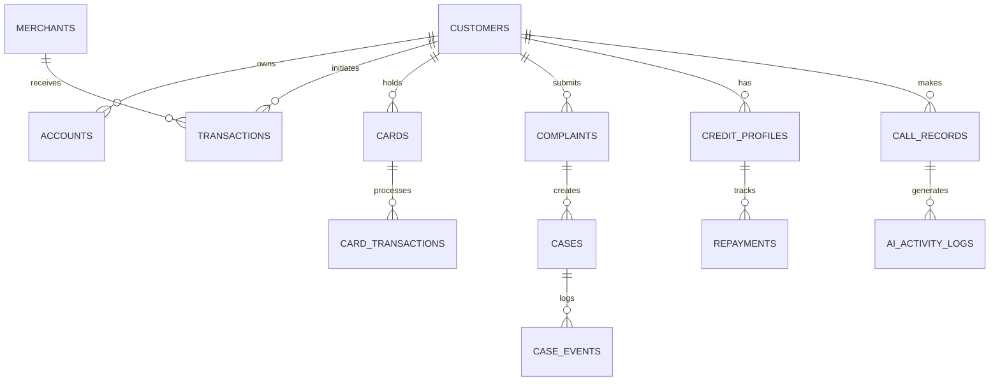

# Upay AI Financial Intelligence Platform — Data Dictionary

## 1. Overview
This document defines the schema, data types, permissible values, relationships, and ML usage for all synthetic data entities in the **Upay AI Financial Intelligence Platform (Part 1 — Data & AI/ML Foundation)**.

All data is 100% synthetic, generated under fixed random seed `20261003` for reproducibility, containing **no real PII** (Personally Identifiable Information).

---

## 2. Entity-Relationship Architecture

---

## 3. Data Dictionary Specifications

### 3.1 Customers (`customers.csv`)
Primary customer profile repository.

| Field Name | Type | Allowed / Sample Values | Description | ML Usage |
|---|---|---|---|---|
| `customer_id` | String (PK) | `SYN-U-10001` - `SYN-U-20000` | Synthetic customer unique identifier | Entity key |
| `age` | Integer | 18 - 72 | Age of customer | Demographic grouping |
| `gender_code` | String | `M`, `F`, `O` | Synthetic demographic code | Demographic analysis |
| `occupation_type` | String | `SALARIED`, `BUSINESS`, `FREELANCER`, `STUDENT`, `HOMEMAKER`, `RETIRED` | Occupation category | Credit Readiness |
| `monthly_income` | Float | 15,000.00 - 350,000.00 | Monthly income in BDT | Credit Readiness Baseline |
| `district` | String | `Dhaka`, `Chittagong`, `Sylhet`, `Rajshahi`, `Khulna`, `Barishal`, `Rangpur`, `Mymensingh`, `Gazipur`, `Cumilla` | Location of customer | Fraud Location Check |
| `account_age_days` | Integer | 30 - 2,500 | Days since account registration | Fraud & Credit Feature |
| `registration_channel` | String | `APP`, `AGENT`, `BRANCH`, `USSD` | Onboarding method | Channel segmentation |
| `device_type` | String | `ANDROID`, `IOS`, `FEATURE_PHONE` | Primary device type | Device fingerprinting |
| `customer_segment` | String | `MASS`, `AFFLUENT`, `STUDENT`, `SME`, `PAYROLL` | Behavioral segment | Segment modeling |
| `account_status` | String | `ACTIVE`, `DORMANT`, `RESTRICTED` | Operational status | Filtering |

---

### 3.2 Merchants (`merchants.csv`)
Merchant directory and baseline risk profiling.

| Field Name | Type | Allowed / Sample Values | Description | ML Usage |
|---|---|---|---|---|
| `merchant_id` | String (PK) | `SYN-M-1001` - `SYN-M-3000` | Merchant identifier | Recipient ID |
| `merchant_category` | String | `GROCERY`, `RESTAURANT`, `E_COMMERCE`, `UTILITY`, `TRAVEL`, `DIGITAL_SERVICE`, `EDUCATION` | Merchant vertical | Fraud risk feature |
| `merchant_location` | String | Bangladesh Districts | Operating district | Location verification |
| `merchant_age_days` | Integer | 60 - 3,000 | Age of merchant account | Merchant trust score |
| `risk_profile` | String | `LOW`, `MEDIUM`, `HIGH` | Historical merchant category risk | Fraud Feature (`merchant_risk`) |
| `average_transaction`| Float | 200.00 - 45,000.00 | Typical ticket size in BDT | Outlier baseline |
| `transaction_frequency` | String | `HIGH`, `MEDIUM`, `LOW` | Daily transaction volume tier | Merchant velocity |

---

### 3.3 Transactions (`transactions.csv`)
The primary transactional dataset feeding Fraud Risk (Model 1) and Behavioral Anomaly (Model 2).

| Field Name | Type | Allowed / Sample Values | Description | ML Usage |
|---|---|---|---|---|
| `transaction_id` | String (PK) | `SYN-TXN-1000001`+ | Unique transaction identifier | Transaction key |
| `customer_id` | String (FK) | `SYN-U-XXXXX` | Initiating customer | Aggregations |
| `timestamp` | Datetime (ISO)| `2026-01-01T00:00:00` - `2026-09-30T23:59:59` | Transaction timestamp | Time-of-day feature |
| `amount_bdt` | Float | 50.00 - 350,000.00 | Transaction amount in BDT | Primary Risk Feature |
| `transaction_type` | String | `SEND_MONEY`, `PAYMENT`, `CASH_OUT`, `CASH_IN`, `TRANSFER`, `BILL_PAYMENT`, `CARD_PAYMENT`, `INTERNATIONAL_PAYMENT`, `REFUND` | Financial operation type | Categorical encoding |
| `merchant_id` | String (FK) | `SYN-M-XXXX` or null | Merchant if payment | Counterparty analysis |
| `merchant_category`| String | Category string or `N/A` | Category of recipient merchant | Encoded risk feature |
| `recipient_id` | String | `SYN-U-XXXXX` or `SYN-M-XXXX` or `EXT-XXXX` | Counterparty recipient identifier | Graph / new counterparty |
| `recipient_type` | String | `MERCHANT`, `AGENT`, `CUSTOMER`, `UTILITY_BILLER`, `BANK` | Type of recipient | Risk weight feature |
| `channel` | String | `APP`, `USSD`, `QR`, `WEB`, `POS` | Access channel | Security context |
| `device_id` | String | `DEV-XXXXXXXX` | Synthetic hardware identifier | Device anomaly detection |
| `location` | String | District Name | Transaction geolocation | Geolocation anomaly |
| `balance_before` | Float | 0.00 - 500,000.00 | Customer account balance before txn | Financial consistency check |
| `balance_after` | Float | >= 0.00 | Account balance post-transaction | Financial consistency check |
| `is_international`| Integer | `0`, `1` | Whether cross-border | High-risk signal |
| `is_new_recipient`| Integer | `0`, `1` | First time paying this recipient | Fraud signal |
| `is_new_device` | Integer | `0`, `1` | Device not previously used | Fraud / Anomaly signal |
| `is_new_location`| Integer | `0`, `1` | Location not in user's top districts| Fraud / Anomaly signal |
| `velocity_1h` | Integer | 0 - 25 | Transactions by user in last 1 hour | Velocity spike feature |
| `velocity_24h` | Integer | 0 - 60 | Transactions by user in last 24 hrs | Velocity trend feature |
| `historical_avg_amount`| Float| 200.00 - 35,000.00 | Customer's 30-day baseline average | Deviation baseline |
| `amount_deviation`| Float | 0.1 - 40.0 | `amount_bdt / historical_avg_amount`| Primary Fraud/Anomaly input |
| `fraud_label` | Integer | `0` (Normal), `1` (Fraud) | Synthetic ground-truth label | Target for Model 1 |

---

### 3.4 Cards (`cards.csv`)
Synthetic Upay dual-currency / virtual card directory.

| Field Name | Type | Allowed Values | Description |
|---|---|---|---|
| `card_id` | String (PK) | `SYN-CRD-10001`+ | Card identifier |
| `customer_id` | String (FK) | `SYN-U-XXXXX` | Cardholder |
| `card_type` | String | `VIRTUAL_PREPAID`, `PHYSICAL_DEBIT`, `DUAL_CURRENCY` | Card tier |
| `currency` | String | `BDT`, `USD`, `DUAL` | Denomination |
| `status` | String | `ACTIVE`, `FROZEN`, `BLOCKED`, `EXPIRED` | Lifecycle state |
| `issue_date` | Date | YYYY-MM-DD | Issuance date |
| `expiry_date` | Date | YYYY-MM-DD | Expiration date |
| `nfc_enabled` | Integer | `0`, `1` | Contactless authorization |
| `online_enabled` | Integer | `0`, `1` | E-commerce authorization |
| `international_enabled`| Integer | `0`, `1` | Cross-border authorization |
| `pin_status` | String | `SET`, `UNSET`, `LOCKED` | Security state |
| `endorsement_limit_usd`| Float | 500.00 - 12,000.00 | Passport passport quota limit |
| `used_usd` | Float | 0.00 - endorsement_limit | Spent in current calendar year |
| `available_usd` | Float | >= 0.00 | Remaining foreign currency quota |

---

### 3.5 Card Transactions (`card_transactions.csv`)
Cross-border and domestic card activities feeding real-time authorization risk.

| Field Name | Type | Sample / Allowed Values | Description |
|---|---|---|---|
| `card_transaction_id`| String (PK)| `SYN-CTXN-1000001`+ | Card transaction identifier |
| `card_id` | String (FK)| `SYN-CRD-XXXXX` | Associated card |
| `customer_id` | String (FK)| `SYN-U-XXXXX` | Cardholder |
| `timestamp` | Datetime (ISO)| ISO timestamp | Authorization time |
| `amount_usd` | Float | 1.00 - 2,500.00 | Charge amount in USD |
| `merchant_id` | String | Merchant ID | Merchant identifier |
| `merchant_country` | String | `BD`, `US`, `SG`, `GB`, `IN`, `AE` | Processing country |
| `device_id` | String | `DEV-XXXXXXXX` | POS / Terminal / Client ID |
| `channel` | String | `POS`, `ONLINE`, `ATM`, `CONTACTLESS`| Terminal interface |
| `is_contactless` | Integer | `0`, `1` | Contactless tap flag |
| `is_online` | Integer | `0`, `1` | Card Not Present (CNP) flag |
| `is_international` | Integer | `0`, `1` | Cross-border transaction flag |
| `is_new_merchant` | Integer | `0`, `1` | First time merchant visit |
| `is_new_device` | Integer | `0`, `1` | Unseen terminal or IP |
| `risk_score` | Integer | 0 - 100 | Real-time ML risk assessment |
| `fraud_probability` | Float | 0.0000 - 1.0000 | XGBoost inference probability |

---

### 3.6 Complaints & Cases (`complaints.csv`, `cases.csv`, `case_events.csv`)
Complaint intelligence, dispute investigation, and workflow automation entities.

#### Complaints (`complaints.csv`)
| Field Name | Type | Allowed Values |
|---|---|---|
| `complaint_id` | String (PK) | `SYN-CMP-10001`+ |
| `customer_id` | String (FK) | `SYN-U-XXXXX` |
| `created_at` | Datetime (ISO)| ISO timestamp |
| `complaint_text` | String | Realistic complaint narrative (Banglish / English) |
| `category` | String | `PAYMENT`, `FRAUD`, `ACCOUNT`, `CARD`, `CASH_OUT`, `TRANSFER`, `REFUND`, `TECHNICAL`, `OTHER` |
| `priority` | String | `LOW`, `MEDIUM`, `HIGH`, `CRITICAL` |
| `assigned_team` | String | `TRANSACTION_OPERATIONS`, `FRAUD_INVESTIGATION`, `DISPUTES`, `CARD_SERVICES`, `TECH_SUPPORT` |
| `initial_status` | String | `RECEIVED` |
| `resolution_type` | String | `REFUNDED`, `EXPLAINED`, `UNBLOCK_ACCOUNT`, `REVERSED`, `DECLINED`, `IN_PROGRESS` |
| `resolution_time_minutes`| Integer | 15 - 4,320 |
| `escalated` | Integer | `0`, `1` |

#### Cases (`cases.csv`)
| Field Name | Type | Allowed Values |
|---|---|---|
| `case_id` | String (PK) | `SYN-CASE-10001`+ |
| `complaint_id` | String (FK) | `SYN-CMP-XXXXX` |
| `customer_id` | String (FK) | `SYN-U-XXXXX` |
| `case_category` | String | Category matching complaint |
| `priority` | String | `LOW`, `MEDIUM`, `HIGH`, `CRITICAL` |
| `status` | String | `OPEN`, `UNDER_REVIEW`, `INVESTIGATING`, `WAITING_FOR_CUSTOMER`, `ESCALATED`, `RESOLVED`, `CLOSED` |
| `progress_percent`| Integer | 0 - 100 |
| `assigned_team` | String | Responsible unit |
| `assigned_agent` | String | Synthetic Agent ID (`AGT-401` to `AGT-420`) |
| `created_at` | Datetime (ISO)| Case inception |
| `updated_at` | Datetime (ISO)| Last status change |
| `resolved_at` | Datetime (ISO)| Closing timestamp or null |
| `escalation_level`| Integer | 0, 1, 2 |

#### Case Events (`case_events.csv`)
| Field Name | Type | Allowed Values |
|---|---|---|
| `case_event_id` | String (PK) | `SYN-EVT-100001`+ |
| `case_id` | String (FK) | `SYN-CASE-XXXXX` |
| `timestamp` | Datetime (ISO)| Timeline log timestamp |
| `event_type` | String | `CASE_CREATED`, `ASSIGNED`, `INVESTIGATION_STARTED`, `TRANSACTION_VERIFIED`, `EVIDENCE_REQUESTED`, `ESCALATED`, `RESOLVED` |
| `description` | String | Progress timeline description |
| `actor_type` | String | `SYSTEM`, `AI_COPILOT`, `AGENT`, `CUSTOMER` |
| `actor_id` | String | Identifier of executing actor |

---

### 3.7 Credit Profiles (`credit_profiles.csv`)
Aggregated customer behavioral financial metrics feeding Credit Readiness (Model 3).

| Field Name | Type | Range / Allowed Values | Description | ML Target / Feature |
|---|---|---|---|---|
| `customer_id` | String (PK/FK)| `SYN-U-XXXXX` | Customer reference | Primary Key |
| `avg_monthly_inflow` | Float | 5,000.00 - 300,000.00 | Average monthly inward cash flow | Feature |
| `avg_monthly_outflow` | Float | 3,000.00 - 280,000.00 | Average monthly outward cash flow | Feature |
| `income_consistency` | Float | 0.05 - 1.00 | Stability ratio of periodic salary/income | Feature |
| `balance_stability` | Float | 0.05 - 1.00 | Daily average balance / peak balance ratio | Feature |
| `cashout_ratio` | Float | 0.00 - 1.00 | Cash-out volume / Total outflow ratio | Feature |
| `transaction_frequency`| Float | 2.0 - 120.0 | Average transactions per month | Feature |
| `account_age_days` | Integer | 30 - 2,500 | Account longevity | Feature |
| `previous_loan_count` | Integer | 0 - 12 | Prior micro-credit facilities availed | Feature |
| `previous_repayment_rate`| Float | 0.00 - 1.00 | On-time repayment track record | Feature |
| `late_payment_count` | Integer | 0 - 10 | Count of late installment payments | Feature |
| `avg_days_late` | Float | 0.0 - 45.0 | Average delay on overdue installments | Feature |
| `credit_risk_label` | Integer | `0` (Credit-ready / Low Risk), `1` (High Risk / Not Ready) | Synthetic target for Model 3 | Target |

---

### 3.8 Repayments (`repayments.csv`)
Historical micro-loan installment performance.

| Field Name | Type | Allowed Values |
|---|---|---|
| `repayment_id` | String (PK) | `SYN-REP-10001`+ |
| `customer_id` | String (FK) | `SYN-U-XXXXX` |
| `loan_id` | String | `SYN-LN-5001`+ |
| `loan_amount` | Float | 2,000.00 - 50,000.00 BDT |
| `installment_amount`| Float | 500.00 - 12,500.00 BDT |
| `due_date` | Date | YYYY-MM-DD |
| `payment_date` | Date | YYYY-MM-DD (or null if delinquent) |
| `days_late` | Integer | 0 - 90 |
| `repaid_amount` | Float | Amount actually paid |
| `default_flag` | Integer | `0` (Paid), `1` (Defaulted) |

---

### 3.9 Voice Scenarios (`voice_scenarios.csv`)
Test harness scenarios for offline and downstream Voice AI evaluation.

| Field Name | Type | Allowed Values |
|---|---|---|
| `scenario_id` | String (PK) | `VOICE-001` - `VOICE-150` |
| `customer_id` | String (FK) | `SYN-U-XXXXX` |
| `intent` | String | `BALANCE_INQUIRY`, `PAYMENT_STUCK`, `COMPLEX_FRAUD`, `CARD_BLOCK_REQUEST`, `LIMIT_CHANGE`, `TRANSACTION_HISTORY`, `DISPUTE_STATUS` |
| `verification_required`| Integer | `0`, `1` |
| `expected_result` | String | Deterministic expected text or state |
| `expected_tool` | String | `get_balance`, `get_transaction`, `create_case`, `freeze_card`, `escalate_to_human`, `get_dispute_status` |
| `should_escalate` | Integer | `0`, `1` |

---

### 3.10 AI Activity Logs (`ai_activity_logs.csv`)
Audit trail, monitoring, latency, and governance traceability for all AI/ML actions.

| Field Name | Type | Allowed Values |
|---|---|---|
| `ai_log_id` | String (PK) | `AI-LOG-100001`+ |
| `timestamp` | Datetime (ISO)| Execution timestamp |
| `session_id` | String | Request or conversation session ID |
| `customer_id` | String (FK) | `SYN-U-XXXXX` |
| `component` | String | `FRAUD_ENGINE`, `ANOMALY_ENGINE`, `CREDIT_ENGINE`, `VOICE_AI`, `REPORT_COPILOT` |
| `action` | String | Operational task performed |
| `tool_name` | String | Executed tool or endpoint |
| `input_reference` | String | Masked / hashed reference to input data |
| `output_reference`| String | Output summary or score |
| `result` | String | `SUCCESS`, `FLAGGED`, `BLOCKED`, `FALLBACK` |
| `latency_ms` | Float | Execution elapsed time in milliseconds |
| `model_version` | String | Active model artifact version |
